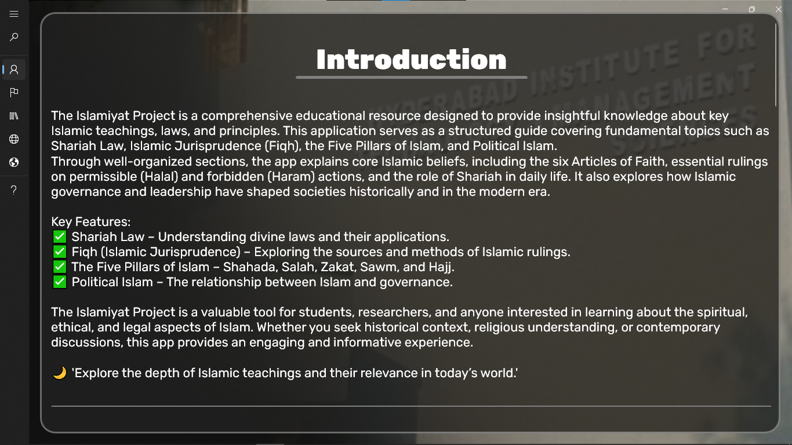
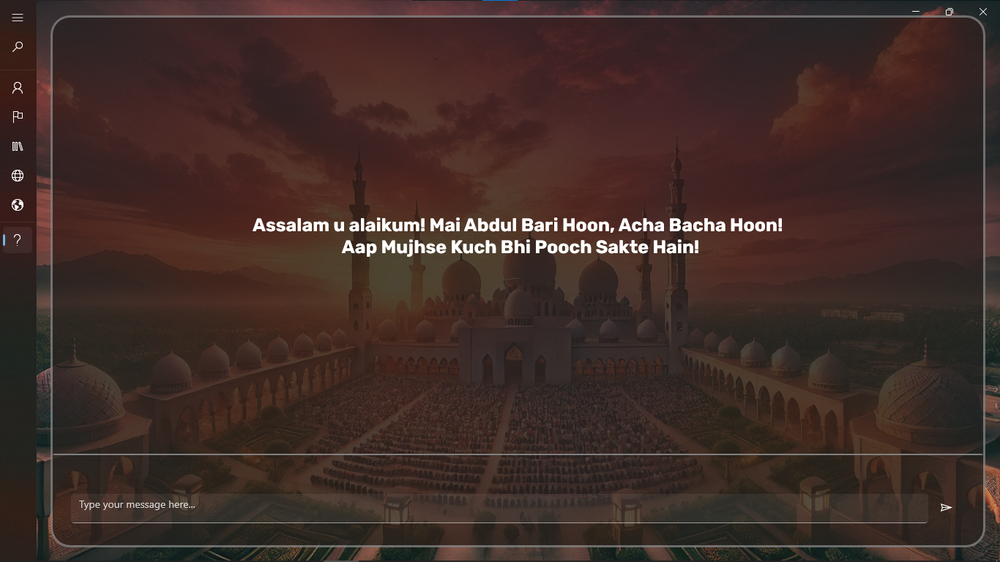

# AI Powered Islamic Application

This is a WinUI 3 application built with C++/WinRT that serves as an educational platform for exploring Islamic teachings. The app features an AI-powered chatbot utilizing the Gemini API, allowing users to ask questions and receive insightful responses.

---
## ✨ Features
- 🧠 **AI Chatbot** – Uses Gemini API for intelligent answers to user queries.
- 🎨 **Modern UI** – Developed with WinUI 3 for a sleek and intuitive interface.
- 🚀 **Smooth Navigation** – Organized sections with NavigationView for easy access.
- 🌐 **WebView2 Integration** – Enables web-based content display.
- 📌 **Progress Indicators** – Real-time loading animations for a seamless experience.

---

## 🏗️ Tech Stack
- **Framework**: WinUI 3 (Windows App SDK)
- **Language**: C++/WinRT
- **Networking**: WinHTTP for API requests
- **UI Components**: XAML & NavigationView
- **AI Integration**: Gemini API for chatbot responses

---

## 🛠️ Installation

### Prerequisites
- Windows 10/11 (x64)
- Visual Studio 2022 with **C++/WinRT** and **WinUI 3** workload installed
- Windows App SDK
- WebView2 Runtime

### Steps
1. **Clone the repository**:
   ```sh
   git clone https://github.com/ARafaykhalid/Islamic-App.git
   cd islamiyat
   ```
2. **Install dependencies**:
   - Ensure you have installed the **Windows App SDK** via NuGet.
   - Install WebView2 runtime if not already available.
3. **Open the project in Visual Studio**:
   - Launch `Islamiyat.sln`
4. **Build & Run**:
   - Set target to **x64 Debug/Release**
   - Press `Ctrl + F5` to run

---

## ⚡ Usage
- Navigate through sections using the side menu.
- Ask the chatbot any question by typing in the input box.
- The chatbot will fetch and display AI-generated responses.

---

## 📸 Screenshots



---

## 🎥 Video Preview
[](https://www.youtube.com/watch?v=a2AWy3VDVVY)  

---

## 🚀 Future Enhancements
- 🔥 Improved AI capabilities with fine-tuned responses.
- 📌 Save & load previous chatbot interactions.
- 🎨 Dark mode support for enhanced UX.

---

💡 *Developed with ❤️ using C++/WinRT and WinUI 3.*

